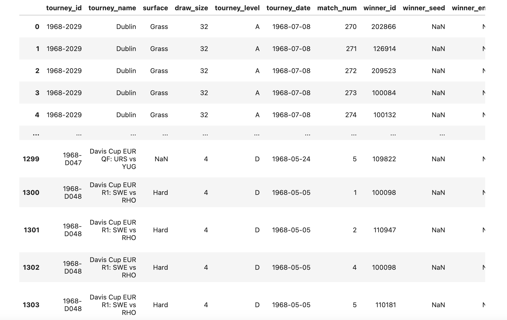

# Analysis of Trends in Tennis Data

This is a continuous project where I spent my time cleaning data related to tennis player's performace in competitions and their background as well as physical characteristics. 
I use regression analysis to understand the trends of male tennis player's performace in historical competitions with respect to varying factors. Check out my result in the **notebook** above. 

Here is an exmaple paper of the type of reuslt and historcal analysis that comes form this project:

## Abstract:

The constant improvement of the tennis racquet has accelerated the pace of tennis to where 130 mph serves are commonplace. Height has given an edge to the top players who are adapting to this new speed, implementing the serve as a critical part of their game. The purpose of this study was to determine the effect of body height on several performance factors in elite male tennis players. The data used contains all recorded ATP matches from 1968 to 2021. The data set contains crucial performance factors such as 1st serve in, 1st serve won, breakpoints faced, breakpoints saved, etc.. To analyze the data, I used data sets, graphing, and statistical analyses. The results indicated that ranking and serve related match outcomes that exhibit considerable variation according to players’ stature and court surface.
